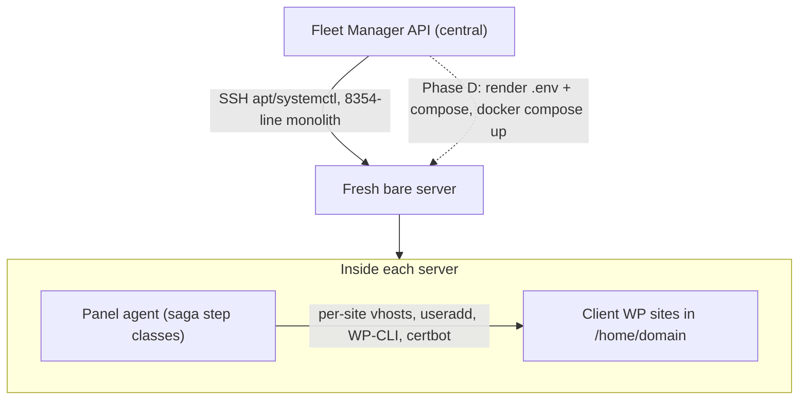
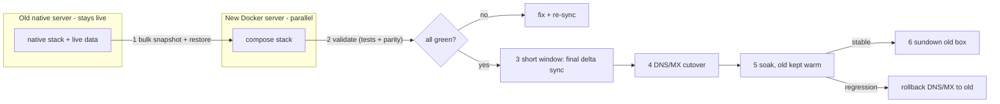

# FlowOne Native-to-Docker Transition Plan

> Source of truth for the migration. Companion doc: `CONTEXT.md` (chat handoff /
> decisions). Mirrors the Cursor plan `native_to_docker_transition_138837d6`.

## Goal and scope

Move the per-fleet-server stack from native Ubuntu (apt + systemd + OpenLiteSpeed) to a
reproducible one-`docker compose`-stack-per-server model, so Fleet Manager deploys a new
server by rendering config + `docker compose up` instead of running the ~8.3k-line native
provisioner. Old and new run in parallel on separate boxes; cut over via DNS/MX; sundown
old after a soak.

In scope: the per-server stack (Email app + Panel + mail pod + MariaDB/Redis/Meilisearch +
collab/mailsync + PowerDNS + OnlyOffice + coTURN/LiveKit) and the client WordPress/hosted
sites that share the box's OLS. Containerizing the central Fleet Manager instance itself is
a later, optional phase.

## Todos / milestones

- [x] **Phase A — Foundations:** Multi-domain landmines fixed (collab WS URL, OAuth +
  share/webhook flowone.pro origins, OpenDMARC/OpenDKIM port drift, LiveKit ws_url guard,
  turn.{domain} DNS seed, PHP 8.3 pin) and the `docker/` tree created. Compose-templates-live-in-repo
  decided (NOT `blueprint_templates` DB). Private registry deferred — building locally for now
  (`REGISTRY`/`TAG` vars already in compose for when one exists).
- [x] **Phase B — Author images:** Multi-stage Dockerfiles done + smoke-tested for the
  bridge-net app tier: `web` (OLS+lsphp83 8.3, baked frontend dist + composer), `collab` (:1234),
  `mailsync` (:1235); mariadb/redis/meilisearch use stock images. DEFERRED to Phase E (Linux box,
  host networking unsupported on Docker Desktop/Windows): mail pod (Rspamd/ClamAV/unbound:5335 +
  8891/8893 milters), powerdns gmysql, onlyoffice, coturn/livekit.
- [x] **Phase B — Author compose:** Per-server `docker-compose.yml` written for the bridge tier
  (mariadb, redis, meilisearch, web, collab, mailsync) with depends_on health ordering, named
  volumes, shared `jwt_keys`, and `.env`-driven entrypoints. Boots clean locally end-to-end
  (login verified against external IMAP). Host-net pods authored separately in Phase E.
- [ ] **Phase C — Migration tooling:** Build snapshot/restore scripts (single mysqldump incl.
  per-site WordPress DBs + pdns gmysql tables, `/home/vmail` rsync, `/home/{domain}`, drive
  files, `/etc/letsencrypt`, DKIM keys, and the non-regenerable `/etc/flowone/*.key` + Fleet
  `encryption.key` + `IMAP_ENCRYPTION_KEY` + all `OAUTH_KEYS` versions + JWT PEMs) with a
  final-delta-sync mode.
- [ ] **Phase C — Test suite:** 3-layer server-side suite. **Layer 1 (stack smoke) DONE** —
  `email/backend/tests/docker-stack-smoke-test.php` (web->mariadb/redis/meili/collab/mailsync/imap,
  schema/migrations, JWT/IMAP-key/OAuth canary), 16/16 green against the local stack. Layers 2
  (functional e2e incl. client WP HTTP 200) and 3 (old-vs-new parity) pending the parallel box.
- [ ] **Phase D — Fleet refactor:** Refactor the 8,354-line `ProvisioningService` from
  apt/systemctl steps to render `.env` + compose then `docker compose pull/up`; switch heartbeat
  health checks from `systemctl is-active` to `docker inspect` (reuse flowone-office pattern);
  retire dead `panel_update`/`email_update` types and mostly retire `ConfigExtractorService`.
- [ ] **Phase E — Staging dry-run:** Provision a throwaway VM with the new stack and run Layer 1+2
  tests (no real data) to prove functional correctness end-to-end.
- [ ] **Phase E — Parallel box:** Provision a real parallel Docker box from a production snapshot,
  restore live data, and run Layer 3 parity validation against the live native box.
- [ ] **Phase F — Cutover:** Execute the cutover for one server: short maintenance window final
  delta sync, DNS/MX flip, monitor soak period with the old box kept warm as rollback.
- [ ] **Phase F — Sundown:** After a clean soak, decommission the old native box and remove
  orphaned native-only code paths; document the new fleet deploy flow.

## What validation against the codebase changed

This plan is a refined version of the original. Key corrections from a full code audit:

- The `mail_db` "vmail vs mailserver" landmine is removed: `vmail` is the Linux UID-5000 mailbox
  owner; `mailserver` is the DB name. They are consistent everywhere. Not a bug.
- Templates are NOT rendered from the `fleet/templates/` filesystem at runtime. That tree is a
  static reference copy. The live engine reads templates from a `blueprint_templates` DB table.
  Phase A must decide where Docker compose/.env templates live (recommendation below).
- The Fleet provisioner is a single 8,354-line file
  (`fleet/api/src/Services/ProvisioningService.php`) with a flat 29-step `STEPS` array, not step
  classes. The clean saga/step classes (`VhostConfigWriteStep`, `HomeDirCreateStep`,
  `DatabaseCreateStep`, `SftpUserCreateStep`, `WordPressInstaller`) live in the SEPARATE Panel
  agent at `panel/agent/Provisioner/Step/Steps/Create/`. That Panel agent code is exactly what we
  keep unchanged inside the containerized OLS tier.
- `panel_update` / `email_update` deployment types are confirmed dead stubs (no-op
  `handleOtherDeployment()`); real updates flow through `APP_UPDATE` -> `deployAppUpdate()`. Safe
  to retire.

## Two separate provisioning systems (do not conflate)

- Fleet monolith = what Phase D rewrites (build/generate/deploy).
- Panel agent saga = stays as-is, runs inside the OLS container (that is why OLS stays
  containerized in Phase 1).

## Key decisions (recommended defaults)

- Orchestration: one `docker compose` stack per server. Not Swarm/k8s for v1.
- Images: build once, push to a private registry, servers pull.
- Web server: keep OpenLiteSpeed + lsphp83 in a container for Phase 1 to preserve the Panel's
  vhost/site sagas and per-vhost LSAPI sockets. nginx + php-fpm flagged as optional later cleanup.
- Control plane: Panel agent stays a privileged host-level agent (host PID/mounts + docker socket)
  for `useradd`, NAS mounts, certbot, DNS; learns to manage the compose stack.
- Mail: single mail pod (Postfix + Dovecot + OpenDKIM + OpenDMARC + Rspamd + ClamAV +
  unbound-on-5335) with `network_mode: host`, sharing `/home/vmail`, reaching MariaDB by service
  name. unbound MUST bind 127.0.0.1:5335 because PowerDNS owns :53; Rspamd milter is
  `inet:localhost:11332`. Wired at runtime by `installMailSecurity()` today; must be baked into the pod.
- PowerDNS: gmysql backend pointed at the shared `devc_vps_dash` DB (the pdns container reaches the
  `mariadb` service; it is not a separate datastore).
- Compose template source of truth: keep Docker `docker-compose.yml` + entrypoints in the repo
  (version-controlled, baked into the image), and render only the per-host `.env` via the Fleet
  engine. Do NOT store compose YAML in the `blueprint_templates` DB table.
- Client WordPress/hosted sites: ride inside the containerized OLS tier with `/home/{domain}`
  bind-mounted and per-site DBs in MariaDB. Not separate containers in v1.

## Target per-server architecture

- Bridge network (internal): `mariadb`, `redis`, `meilisearch`, `web` (OLS+lsphp83, serves FlowOne
  + client vhosts), `collab` (:1234), `mailsync` (:1235), `onlyoffice` (:8090 internal).
- Host networking: `mail` pod, `powerdns` (:53), `coturn`/`livekit` (UDP ranges), and the `web`
  tier (80/443).
- Volumes for all live state (see migration buckets), including `/home/{domain}`.

## The three migration buckets (safety model)

- **BAKE into image:** PHP source + `composer install`, frontend `dist` (`vite build`), Node
  services (collab, mailsync), repo config templates and entrypoints.
- **INJECT per host via `.env`:** domains, secrets, `127.0.0.1`->service-name hostnames
  (`DB_HOST=mariadb`, `REDIS_HOST=redis`, `MEILI_HOST=http://meilisearch:7700`, `MAIL_DB_HOST`),
  `FRONTEND_URL`, `LIVEKIT_WS_URL`, CORS, API keys. Backend already reads all of these from env
  with localhost fallbacks (`email/backend/src/config.php`).
- **MIGRATE byte-for-byte:** `/var/lib/mysql` (incl. per-site WP DBs + the pdns gmysql tables in
  `devc_vps_dash`), `/home/vmail`, `/home/{domain}`, `storage/drive` + `/mnt/nas-drive`,
  Meilisearch data, `/etc/letsencrypt`, `/etc/opendkim/keys`, AND the non-regenerable keys:
  `/etc/flowone/master.key` (SecretVault), `/etc/flowone/state.key` (storage HMAC), Fleet
  `encryption.key` (AES-256-GCM), `IMAP_ENCRYPTION_KEY`, all `OAUTH_KEYS` versions, and the JWT
  PEM pair (backend signs; mailsync + collab verify with the public key). Regenerating any of these
  bricks encrypted data or logs everyone out.

## Must-fix-in-code before multi-domain cutover (all verified)

- Collab WS hardcodes `wss://${window.location.hostname}:1234` in
  `email/frontend/src/collab/composables/useCollabProvider.js` (lines 15-32) — route via
  `/collab_ws` or bake `VITE_COLLAB_WS_URL`.
- OAuth origin checks hardcode `flowone.pro` in `email/frontend/src/views/MailboxView.vue`
  (287, 436) and `email/frontend/src/components/AccountSwitcher.vue` (378, 517) — use
  `window.location.origin`.
- Additional hardcoded `flowone.pro` functional breaks: mood-board share base in
  `email/frontend/src/addons/moodboards/components/MoodBoardSettings.vue:761` and the automation
  webhook URL in `email/frontend/src/addons/automation-hub/components/sidebar/NodeConfigPanel.vue:1790`
  — derive from origin/configured host.
- Port/name drift: standalone `fleet/installer/mail-install.sh` writes OpenDMARC `54321` and
  OpenDKIM `12301`, while `ProvisioningService.php` and the Postfix template use `8893`/`8891`.
  Bake one correct set into the mail pod and delete the divergent installer values.
- LiveKit: default `ws_url` `wss://devcon1.hu:7443` is the stunnel port; an empty `livekit_ws_url`
  column throws `RuntimeException`. Always set `LIVEKIT_WS_URL` in `.env`; fail provisioning loudly
  if blank.
- Seed a `turn.{domain}` A record in `seedDnsRecords()` (coTURN config expects it; not currently
  published).
- Pin the web image to PHP 8.3 + OLS/lsphp83 with `imap, redis, gd, zip, mbstring, intl,
  pdo_mysql, xml, opcache` (plus `openssl, curl, fileinfo`). The local seed `email/Dockerfile.local`
  is `php:8.2-apache` + MySQL 8.0 — upgrade to 8.3/OLS + MariaDB for production parity.

## Parallel run + cutover flow

## Testing strategy

Follow the repo server-side-testing convention (CLI-only; `--help`/`--verbose`/`--smoke`/`--json`/
`--only=`/`--skip-send`; non-destructive; `[FLOWONE-TEST]`-prefixed data; per-test timeouts;
timestamped logs in `storage/logs/`; non-zero exit on failure). Extend the existing 103 scripts in
`email/backend/tests` (e.g. `per-domain-routing-test.php`). Three layers:

- **Layer 1 (image/stack smoke, no real data, throwaway VM):** containers start, health endpoints
  green, service-to-service connectivity (web->mariadb/redis/meili, web->mail, mailsync->imap,
  pdns->mariadb on `devc_vps_dash`).
- **Layer 2 (functional e2e on the parallel box):** login/JWT, SMTP+IMAP roundtrip with
  `[FLOWONE-TEST]` subject, Sieve, DKIM present + DMARC pass (verifying 8891/8893 milters wired),
  Meilisearch index/query, Drive upload/download + NAS tiering, collab edit, OnlyOffice open/save,
  LiveKit token + ICE, push registration, and each client WordPress site returns HTTP 200 +
  DB-backed page through the containerized OLS.
- **Layer 3 (migration parity, old vs new):** per-table row counts (incl. per-site WP DBs and pdns
  records), mailbox count + maildir byte size, sampled drive checksums, Meilisearch doc counts, and
  a live auth + mail roundtrip. Must match before cutover.

## Risks

- Mail deliverability (IP reputation / PTR / DKIM) is a provider concern, unchanged by Docker;
  validate before MX flip.
- `mailsync` (in-memory call/huddle state, :1235) must stay single-replica; `collab` (:1234)
  single Node process; no horizontal scaling in v1.
- Panel agent host-coupling (`useradd`, OLS vhosts, certbot) is the largest refactor surface;
  keeping OLS containerized in Phase 1 contains it.
- The pdns gmysql backend shares `devc_vps_dash`; the snapshot/restore must keep pdns tables
  consistent with the rest of the DB (single mysqldump, not selective).
