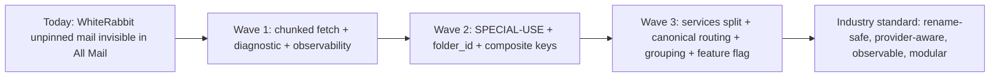
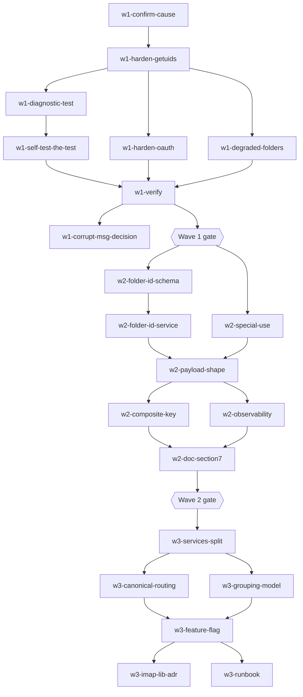
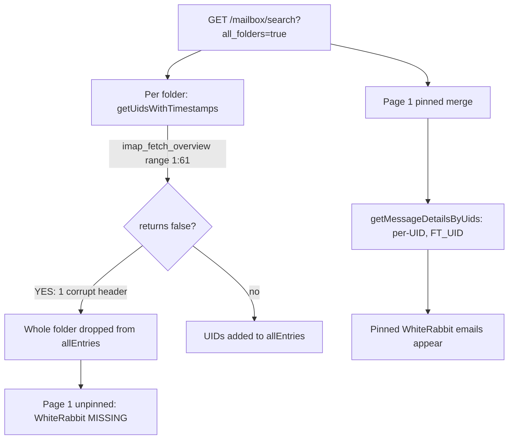

# Mailbox folder system - industry standard

This plan merges the bug fix for WhiteRabbit's silent All Mail skip with the broader folder-identity / routing / grouping refactor. It runs in three waves so production stays stable while we improve the foundation. Each todo carries its own acceptance criteria; each destructive change carries a rollback plan; gates between waves prevent half-finished work from leaking forward.

## Why three waves

The WhiteRabbit symptom is a backend IMAP fetch resilience problem. The frontend folder-identity work in the original overview is good, but it does not fix that bug and is too big to ship in one pass. Splitting unblocks the user immediately, then prevents the next bug, then graduates the architecture.




## Dependency graph (within and across waves)

Sequential edges = must finish first. Items at the same level can run in parallel.




## Wave-entry gates

Hard gates. Don't start the next wave until every gate item is true.

**Gate to start Wave 2:**

- Wave 1 deployed to production for at least 7 consecutive days.
- Zero `[ALLMAIL]` skip lines for the affected user during that period (i.e. the corrupt-msg decision was made and the fix proves out in the wild).
- `all-mail-coverage-test.php` exits 0 on a nightly cron for all active accounts for 7 days.
- `degraded_folders[]` banner has been seen at least once in QA against an intentionally corrupted test mailbox (proves the surfacing mechanism works).

**Gate to start Wave 3:**

- Wave 2 in production for at least 14 consecutive days.
- `folder_id` populated for 100% of folder rows in `folder_index` (no NULL, no dupes).
- Folder rename test (rename a non-empty folder on server, observe pins/labels/conversation refs survive) passes manually for at least one user.
- Daily coverage report cron green (no degraded folders) for 14 days.
- SPECIAL-USE detection verified against at least three providers (Dovecot, Gmail-via-IMAP, M365-via-IMAP) - or documented as not-applicable if you only have Dovecot.

---

## Wave 1 - Stop the bleeding (this week)

Goal: WhiteRabbit's unpinned mail shows up in All Mail. No frontend changes outside a small degraded-folders banner.

### Root cause recap

`ImapService::getUidsWithTimestamps()` ([email/backend/src/Services/ImapService.php:5129](email/backend/src/Services/ImapService.php)) fetches headers for an entire folder in one `imap_fetch_overview($conn, "$start:$total", 0)` call. PHP's c-client returns `false` for the whole range if any single message in it has a header it can't parse. The folder is then dropped silently from `$allEntries` in `MailboxController::search()` ([email/backend/src/Controllers/MailboxController.php:2500](email/backend/src/Controllers/MailboxController.php)). Pinned messages still appear because the pinned-merge fallback uses per-UID fetch (`getMessageDetailsByUids()` at [email/backend/src/Services/ImapService.php:5217](email/backend/src/Services/ImapService.php)), which is resilient.




### Files

**[email/backend/src/Services/ImapService.php](email/backend/src/Services/ImapService.php)** - rewrite `getUidsWithTimestamps()` and `getUidsWithTimestampsOAuth()` with tiered fallback. Acceptance criteria already in `w1-harden-getuids` / `w1-harden-oauth` todos.

**[email/backend/src/Controllers/MailboxController.php](email/backend/src/Controllers/MailboxController.php)** - `search()` (around line 2483-2554) collects per-folder skip data and adds `degraded_folders` to the response. Acceptance: array empty in happy case, populated when `retrieved < total` for an eligible folder.

**[email/frontend/src/stores/mailbox.js](email/frontend/src/stores/mailbox.js)** - `fetchAllMail()` (line ~2177) reads `data.degraded_folders` into `mailbox.allMailDegraded` ref.

**[email/frontend/src/components/EmailList.vue](email/frontend/src/components/EmailList.vue)** - dismissible banner. Acceptance in `w1-degraded-folders` todo.

**[email/backend/tests/all-mail-coverage-test.php](email/backend/tests/all-mail-coverage-test.php) (new)** - per server-side-testing rule. Acceptance in `w1-diagnostic-test` todo.

### Test inventory (Wave 1)

- `email/backend/tests/all-mail-coverage-test.php` (new) - the diagnostic.
- Manual QA: corrupt-header banner test (intentional bad message in throwaway mailbox).

### Rollback plan (Wave 1)

Wave 1 is non-destructive (no schema changes, no URL changes). Rollback = revert the `ImapService.php` and `MailboxController.php` commits. The `degraded_folders` field is additive and the frontend banner is dismissible, so leaving partial frontend changes deployed is harmless.

### Metric thresholds (Wave 1)

- Healthy-folder fetch time regression: < 10%.
- `[ALLMAIL]` skip log lines per day post-fix: 0 (the whole point).
- Coverage cron pass rate (nightly): 100% across all active accounts for 7 days.

### Wave 1 done when

- `Re: AI mesekonyv` from `INBOX.Work.WhiteRabbit` appears in All Mail under Today.
- `all-mail-coverage-test.php` exits 0 against the user's full mailbox.
- Corrupt UID(s) decision recorded (`w1-corrupt-msg-decision`).
- Banner verified end-to-end in QA.
- No regression in healthy-folder fetch time.

---

## Wave 2 - Make the next bug impossible (next sprint)

Goal: kill the substring folder-type bug, introduce stable `folder_id`, make silent skips loud.

### 2.1 SPECIAL-USE flag detection (RFC 6154)

Today `ImapService::getFolderType()` ([email/backend/src/Services/ImapService.php:634](email/backend/src/Services/ImapService.php)) does substring matching:

```634:648:email/backend/src/Services/ImapService.php
    private function getFolderType(string $name): string
    {
        $lower = strtolower($name);
        
        if ($lower === 'inbox') return 'inbox';
        if (str_contains($lower, 'sent')) return 'sent';
        if (str_contains($lower, 'draft')) return 'drafts';
```

Latent bug: any user folder containing `sent`, `draft`, `trash`, `bin`, `junk`, `spam` gets system-classified and excluded from All Mail. Examples that break today: `Sent_archive`, `Customer_consent`, `Documents_to_be_sent`, `Junk_lead_pipeline`, `Bin_review`.

Replacement: parse RFC 6154 flags (`\Sent`, `\Drafts`, `\Trash`, `\Junk`, `\Archive`, `\All`, `\Important`, `\Flagged`) from `imap_getmailboxes` (returns flag attributes) instead of `imap_list` (just names). Acceptance in `w2-special-use` todo.

### 2.2 Stable `folder_id`

Today the only folder identifier is the IMAP path string. Renaming `INBOX.Work` to `INBOX.Projects` invalidates pins, labels, conversation refs, and grouping rules. There's no rename detection.

Approach:

- `folder_id = sha1(account_id . ':' . normalize(folder_path))` computed once when first seen, persisted.
- New table `folder_index` (account_id, folder_id, folder_path, display_name, special_use, parent_folder_id, last_seen_at).
- On every `listFolders()`, upsert. Detect renames via UIDVALIDITY continuity + display-name fuzzy match.
- Migrate `pinned_emails`, `email_labels`, `email_reactions`, `conversation_meta` from `(folder, uid)` to `(folder_id, uid)`.

Files: new migration in `email/backend/migrations/`, [email/backend/src/Services/ImapService.php](email/backend/src/Services/ImapService.php) (`listFolders()` upserts and returns `folder_id`), `email/backend/src/Services/FolderIndexService.php` (new). Acceptance per `w2-folder-id-*` todos.

### 2.3 Frontend composite key

[email/frontend/src/stores/mailbox.js](email/frontend/src/stores/mailbox.js) currently keys messages by `folder:uid` strings (line ~2194: `keys like "INBOX:1547"`). Add `folder_id:uid` parallel key, migrate readers gradually. Acceptance in `w2-composite-key` todo.

### 2.4 Observability

- Promote `error_log("[ALLMAIL] ...")` to structured JSON: `error_log(json_encode(['evt' => 'allmail_skip', 'folder' => $f, 'reason' => $r, 'user' => $u]))`.
- New cron `email/backend/cron/all-mail-coverage-report.php` - daily, runs the coverage test for each active user, mails admin if any folder has `entries < total`.
- Acceptance in `w2-observability` todo.

### Test inventory (Wave 2)

- `email/backend/tests/folder-special-use-test.php` (new) - SPECIAL-USE detection across providers.
- `email/backend/tests/folder-id-rename-test.php` (new) - rename folder on server, assert pins/labels survive.
- `email/backend/tests/folder-payload-contract-test.php` (new) - asserts `folder_id`/`name`/`display_name`/`special_use`/`parent_id`/`account_id` present.
- `email/backend/migrations/NNN_folder_index.sql` (new) - forward + corresponding `NNN_folder_index_rollback.sql`.

### Rollback plan (Wave 2)

The destructive item is the `folder_id` migration on `pinned_emails` / `email_labels` / `email_reactions` / `conversation_meta`.

- Forward migration adds `folder_id` columns as NULLABLE and dual-writes for 14 days. No data dropped.
- Backfill runs as a separate idempotent script; rerunnable.
- Rollback steps if production breaks:
  1. Revert application code (continue using `(folder, uid)` lookup paths).
  2. `folder_id` columns remain in tables but are simply ignored - no DROP.
  3. After stable, decide whether to retry or abandon and ship the rollback DROP migration.
- Pre-flight: snapshot DB before applying migration; run forward + rollback against the snapshot first.

### Metric thresholds (Wave 2)

- `folder_id` NULL rate post-backfill: 0%.
- Folder rename failure rate (pins lost): 0%.
- Coverage cron healthy days: 14 consecutive before Wave 3 starts.
- Structured-log volume (healthy state): < 10 KB/day across all users.

### Wave 2 done when

- No folder is system-classified by substring against a SPECIAL-USE-aware server.
- `folder_id` present in every folder payload and DB row.
- Pin survives a folder rename (manual test).
- Daily coverage report cron green for 14 days.
- `email-life.md` section 7 updated.

---

## Wave 3 - Industry-standard architecture (scoped quarterly project)

Goal: implement the modular frontend originally proposed, behind a feature flag with instant rollback.

### 3.1 Service split

New files (each under 400 lines per workspace modularity rule):

- `email/frontend/src/services/mail/folderIdentityService.js`
- `email/frontend/src/services/mail/mailRouteService.js`
- `email/frontend/src/services/mail/folderGroupingService.js`

Acceptance in `w3-services-split` todo.

### 3.2 Canonical routing + legacy redirect

Routes adopt `slug--folder_id` (slug cosmetic, id authoritative). Old URLs (e.g. `/mail/INBOX.Work.WhiteRabbit`) parse and 301-redirect. Acceptance in `w3-canonical-routing` todo.

Files: [email/frontend/src/router/index.js](email/frontend/src/router/index.js), [email/frontend/src/views/MailboxView.vue](email/frontend/src/views/MailboxView.vue), [email/frontend/src/components/FolderTree.vue](email/frontend/src/components/FolderTree.vue), [email/frontend/src/stores/mailbox.js](email/frontend/src/stores/mailbox.js).

### 3.3 Grouping model

Config-driven, stored per user:

```
groups: [
  { id: 'system-inbox', system: true, type: 'inbox' },
  { id: 'system-sent',  system: true, type: 'sent'  },
  { id: 'user-clients', system: false, label: 'Clients',
    folder_ids: ['a3f...', 'b41...', 'c98...'] }
]
```

Files: `email/backend/migrations/NNN_folder_groups.sql` (new), `email/backend/src/Controllers/FolderGroupController.php` (new), `email/frontend/src/services/mail/folderGroupingService.js` (above).

### 3.4 Feature-flag rollout

`ff_canonical_folder_routing` flag, three states: `off` / `compare` / `on`. Cut over only when mismatch rate < 0.01% for 7 consecutive days. Retain flag for 30 days post-cutover for instant rollback. Acceptance in `w3-feature-flag` todo.

### 3.5 IMAP library evaluation (spike)

ADR `docs/adr/0001-imap-library.md` comparing:

- Stay on `php-imap` extension (status quo, c-client brittleness).
- `webklex/php-imap` (active, pure-PHP, supports CONDSTORE, IDLE).
- `ddeboer/imap` (active, Composer-friendly, but thin wrapper around c-client).

Decide: continue, swap, or hybrid. No code changes in Wave 3 - only the decision. Acceptance in `w3-imap-lib-adr` todo.

### Test inventory (Wave 3)

- `email/frontend/tests/folder-routing-test.js` (new) - route roundtrip + legacy URL migration.
- `email/frontend/tests/folder-naming-edge-cases-test.js` (new) - case/space/special-char/unicode names.
- `email/frontend/tests/folder-hierarchy-test.js` (new) - dot/slash hierarchy.
- `email/frontend/tests/virtual-folder-open-test.js` (new) - same UID in different folders + virtual-folder open with/without folder hint.
- `email/frontend/tests/folder-rename-frontend-test.js` (new) - rename behavior against the canonical-routing layer.

### Rollback plan (Wave 3)

The destructive item is canonical URL migration. Risks: bookmarks, browser history, links in old emails or signatures.

- Legacy URL parser + 301 redirect stays in place permanently (not just during rollout).
- Feature flag cut to `off` reverts to legacy routing instantly without redeploy.
- Compare mode logs every mismatch with full payload so any bug is observable before flipping `on`.
- Retain `ff_canonical_folder_routing=off` capability for at least 30 days after `on`. Don't delete legacy code until that window passes.

### Metric thresholds (Wave 3)

- Compare-mode mismatch rate: < 0.01% sustained for 7 days before flag flips to `on`.
- Legacy-URL 301 redirect success rate: > 99.9%.
- Service file size: each `services/mail/*.js` under 400 lines.

### Wave 3 done when

- No folder-name transformation logic remains in `MailboxView.vue` or `mailbox.js` routing paths.
- Canonical key used everywhere for folder identity.
- Virtual-folder message opening always carries `folder_id`.
- Groupings config-driven and rename-safe.
- Legacy URLs work via redirect.
- All test files in the Wave 3 inventory exist and pass.
- Telemetry confirms < 0.01% mismatches for 7 days, then flag flipped to `on`.
- ADR written and circulated.
- Ops runbook committed and reviewed.

---

## Documentation deliverables (whole plan)

Tracked as todos `w2-doc-section7` and `w3-runbook`, plus the ADR in `w3-imap-lib-adr`. Summary:

- [email/email-life.md](email/email-life.md) section 7 updated with the new tiered-fallback flow + `degraded_folders` contract (Wave 2).
- `docs/runbooks/all-mail-troubleshooting.md` (new, Wave 3) - how to read `[ALLMAIL]` log lines, interpret `degraded_folders`, run the coverage cron manually, flip the feature flag.
- `docs/adr/0001-imap-library.md` (new, Wave 3) - ADR on whether to swap the IMAP library.

## Definition of done (whole plan)

- WhiteRabbit's `Re: AI mesekonyv` appears in All Mail (Wave 1).
- No folder is excluded from All Mail because of a substring or substring-collision bug (Wave 2).
- Renaming a folder on the server does not lose pins/labels/conversation refs (Wave 2).
- Frontend has zero ad-hoc folder string transforms; routing/identity/grouping live in dedicated services (Wave 3).
- Telemetry on every silent failure point; daily coverage report cron is green for 14 consecutive days (Waves 1+2).
- Test coverage for every edge case in the test inventory above.
- Runbook + ADR + section-7 doc all merged.

## Out of scope (deliberately)

- Conversation grouping inside All Mail - already disabled by design per [email/email-life.md](email/email-life.md) section 7.
- Raising `ALLMAIL_SCAN_LIMIT` above 500 - separate perf concern.
- Repairing the actual corrupt message in WhiteRabbit beyond the `w1-corrupt-msg-decision` todo.

