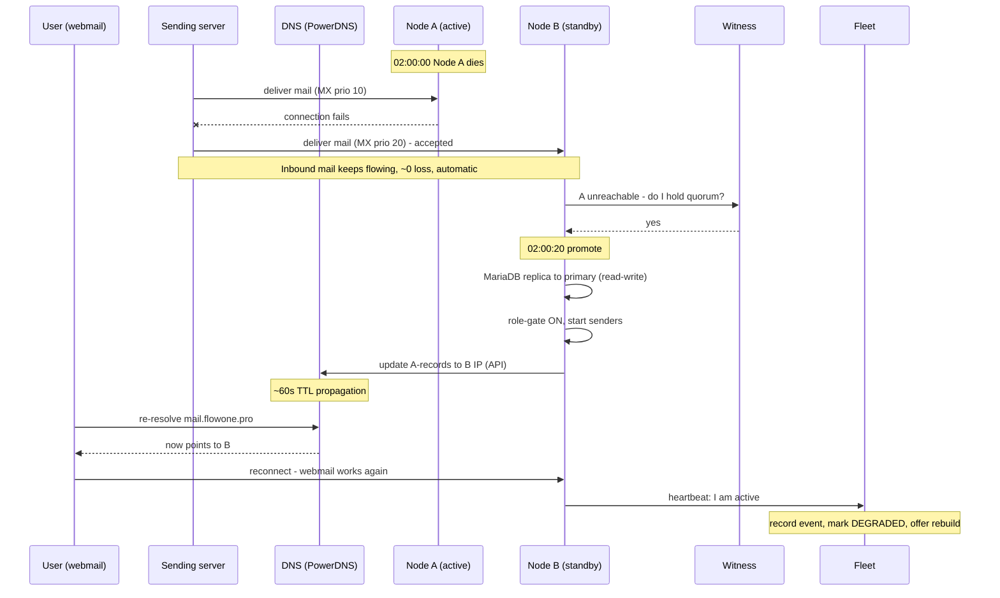
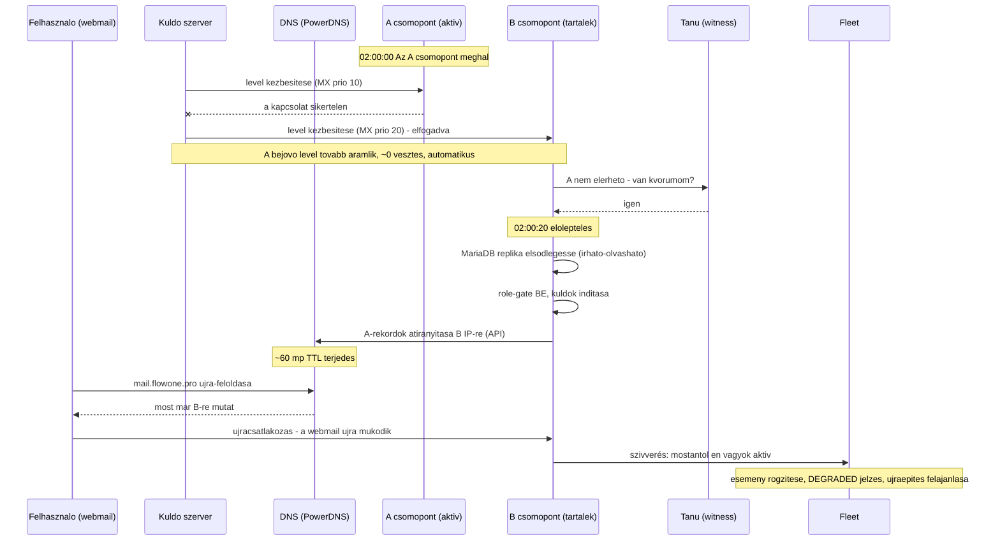

# HA Failover Timeline (Email) / HA Átállási Idővonal (Email)

This document explains, second by second, how an email failover plays out in the FLOWONE high-availability model used on fixed-IP VPS hosting (no cloud floating IP, no provider power API). The mechanism is: **secondary MX for inbound mail + DNS failover for user access + a witness + self-fencing.**

Ez a dokumentum másodpercről másodpercre elmagyarázza, hogyan zajlik egy email-átállás (failover) a FLOWONE magas rendelkezésre állású modelljében, fix IP-s VPS-hosting esetén (nincs felhős floating IP, nincs szolgáltatói power API). A mechanizmus: **másodlagos MX a bejövő levélhez + DNS-átállás a felhasználói hozzáféréshez + tanú (witness) + ön-leállítás (self-fence).**

---

# English

## The cast (steady state, before the failure)

- **Node A** (`mail1`, IP 1.2.3.4) - active. Role-gate ON, MariaDB primary (read-write), Dovecot live, runs the singleton senders (`drain-outbox`, `process-scheduled-emails`, `mailsync`). The A-records (`mail.flowone.pro`, `smtp.flowone.pro`) point here, with a low DNS TTL (~60s).
- **Node B** (`mail2`, IP 5.6.7.8) - standby. Role-gate OFF, MariaDB replica (read-only), Dovecot replica. Postfix is running so it can accept mail as the secondary MX, but it does NOT run the senders.
- **Witness** - a small box in a third location (separate failure domain); the quorum tiebreaker.
- **DNS** (your PowerDNS): MX `mail1` priority 10, `mail2` priority 20 (both always published); A-records point to Node A's IP.

## Visual

## Timeline, second by second

**02:00:00 - Node A dies** (kernel panic / host outage / network cut).

**Inbound mail (automatic, instant, no decision needed):**
- A sending server tries `mail1` (MX 10), the connection fails, so it immediately falls back to `mail2` (MX 20) and delivers there. Node B accepts the mail and writes it into the replicated mailbox.
- This needs no detection, no witness, and no DNS change - it is pure SMTP fallback. Inbound mail loss is ~zero from the first second.

**02:00:00-02:00:20 - Detection:**
- Node B and the witness notice that A's health checks stopped responding. The interval is tuned so it confirms "A is really gone" only after several missed checks (not one), to avoid flapping.

**02:00:20 - Promotion decision (split-brain prevention):**
- Before promoting, Node B asks the witness: "I cannot see A - do I hold quorum?" B + witness form a majority, so B is cleared to promote.
- B never promotes just because it cannot see A; it promotes only when the witness agrees A should be treated as dead.

**02:00:20-02:00:30 - Node B becomes active:**
- MariaDB replica is promoted to primary (read-write).
- Role-gate flips ON, so the singleton senders (`drain-outbox`, `process-scheduled-emails`, `mailsync`) start on B.
- B calls the PowerDNS API to repoint the A-records (`mail.flowone.pro`, `smtp.flowone.pro`) to B's IP (5.6.7.8).

**02:00:30-02:01:30 - DNS propagation window:**
- This is the only slow part. Webmail/IMAP/submission users were pointed at A's dead IP. As their resolvers' cached records expire (the ~60s TTL), they re-resolve and reconnect to B.
- During this window users may see "cannot connect" and clients retry. Effective user-facing downtime is roughly detection + TTL, about 1-2 minutes.

**~02:01 onward - Fleet observes:**
- B's next heartbeat reports "I am active now." Fleet records a failover event, marks the cluster DEGRADED (now running on one node), and - if enabled - triggers building a replacement standby.

## The tricky case: A is alive but isolated (network partition)

If A did not actually die but only lost its network to B and the witness (while perhaps still reachable by some users), both nodes could think they are active, causing double-sent mail. The self-fence handles it:
- A notices it cannot reach the witness OR B, so it has lost quorum, so it voluntarily stops its own services (role-gate OFF, stop senders).
- Meanwhile B can reach the witness, so B holds quorum and promotes.
- Only the side that can reach the witness becomes active. The witness's third-location placement ensures only one side wins. This replaces the remote power-off that a Hungarian fixed-IP VPS does not provide.

## In-flight outbound mail (nuance)

- App-driven sends (scheduled emails, campaigns, the outbox) are tracked in the database, which is replicated to B. When B becomes active it picks up the unsent rows and continues, skipping anything already marked "sent" (idempotency). Tiny edge case: if A sent something but died before the "sent" flag replicated, one duplicate is possible. GTID replication is near-real-time, so this window is small.
- Postfix's own internal spool (messages handed to Postfix but not yet delivered to the outside world) lives on A's local disk and is not replicated - those wait until A returns. Usually a small amount.

## Recovery - when A comes back online

- A must rejoin as a standby and never auto-promote (it is now stale; B has newer data).
- A becomes a replica of B and re-syncs (MariaDB GTID catch-up + Dovecot dsync). Once the validator's gates pass (lag ~0, key-hash match, etc.), the cluster returns to HEALTHY.
- If A's host is dead for good, Fleet builds a fresh replacement standby and A is dropped (the "cattle" replace flow).

## RTO summary per flow

- Inbound mail (other servers to you): ~0 loss, automatic from second one (MX fallback + sender retries).
- Webmail / IMAP / outbound submission (your users): down ~1-2 minutes (detection + DNS TTL), then self-heals.
- Data: no loss up to the last replicated transaction; a tiny edge window on the very last in-flight operation.

This split is why the model works well for email on fixed-IP hosting: the loss-sensitive path (inbound) is protected instantly and for free, and only the tolerant path (a user's webmail reconnecting) pays the DNS-propagation cost.

---

# Magyar

## A szereplők (nyugalmi állapot, a hiba előtt)

- **A csomópont** (`mail1`, IP 1.2.3.4) - aktív. Role-gate BE, MariaDB elsődleges (írható-olvasható), Dovecot él, futtatja az egyedi (singleton) küldőket (`drain-outbox`, `process-scheduled-emails`, `mailsync`). Az A-rekordok (`mail.flowone.pro`, `smtp.flowone.pro`) ide mutatnak, alacsony DNS TTL-lel (~60 mp).
- **B csomópont** (`mail2`, IP 5.6.7.8) - tartalék (standby). Role-gate KI, MariaDB replika (csak olvasható), Dovecot replika. A Postfix fut, így másodlagos MX-ként el tud fogadni levelet, de NEM futtatja a küldőket.
- **Tanú (witness)** - egy kis gép egy harmadik helyszínen (külön hibadoménben); a kvórum döntőbírója.
- **DNS** (a saját PowerDNS): MX `mail1` prioritás 10, `mail2` prioritás 20 (mindkettő mindig publikálva); az A-rekordok az A csomópont IP-jére mutatnak.

## Ábra

## Idővonal, másodpercről másodpercre

**02:00:00 - Az A csomópont meghal** (kernel pánik / host-kimaradás / hálózatszakadás).

**Bejövő levél (automatikus, azonnali, nincs szükség döntésre):**
- A küldő szerver megpróbálja a `mail1`-et (MX 10), a kapcsolat sikertelen, így azonnal a `mail2`-re (MX 20) vált, és oda kézbesít. A B csomópont elfogadja a levelet, és beírja a replikált postafiókba.
- Ehhez nincs szükség észlelésre, tanúra vagy DNS-változtatásra - ez tisztán SMTP-tartalék (fallback). A bejövő levél vesztesége az első másodperctől ~nulla.

**02:00:00-02:00:20 - Észlelés:**
- A B csomópont és a tanú észreveszi, hogy az A egészségügyi ellenőrzései (health check) nem válaszolnak. Az intervallum úgy van hangolva, hogy csak több kihagyott ellenőrzés után (nem egy után) erősítse meg, hogy "az A tényleg elment", elkerülve az ide-oda billegést (flapping).

**02:00:20 - Előléptetési döntés (split-brain megelőzése):**
- Az előléptetés előtt a B csomópont megkérdezi a tanút: "Nem látom az A-t - van kvórumom?" A B + tanú többséget alkot, így a B engedélyt kap az előléptetésre.
- A B sosem lép elő pusztán azért, mert nem látja az A-t; csak akkor lép elő, ha a tanú egyetért abban, hogy az A-t halottnak kell tekinteni.

**02:00:20-02:00:30 - A B csomópont aktívvá válik:**
- A MariaDB replikát elsődlegessé léptetjük (írható-olvasható).
- A role-gate BE-kapcsol, így az egyedi küldők (`drain-outbox`, `process-scheduled-emails`, `mailsync`) elindulnak a B-n.
- A B meghívja a PowerDNS API-t, hogy az A-rekordokat (`mail.flowone.pro`, `smtp.flowone.pro`) a B IP-jére (5.6.7.8) irányítsa át.

**02:00:30-02:01:30 - DNS-terjedési ablak:**
- Ez az egyetlen lassú rész. A webmail/IMAP/küldés felhasználói az A halott IP-jére mutattak. Ahogy a feloldóik (resolver) gyorsítótárazott rekordjai lejárnak (a ~60 mp-es TTL), újra feloldják és újracsatlakoznak a B-hez.
- Ebben az ablakban a felhasználók "nem lehet csatlakozni" hibát láthatnak, és a kliensek újrapróbálkoznak. A tényleges felhasználói kiesés nagyjából az észlelés + TTL, azaz kb. 1-2 perc.

**~02:01-től - A Fleet észleli:**
- A B következő szívverése jelenti, hogy "mostantól aktív vagyok". A Fleet rögzít egy átállási eseményt, a fürtöt DEGRADED (leromlott) állapotúra állítja (most egy csomóponton fut), és - ha engedélyezve van - elindítja egy pótló tartalék felépítését.

## A trükkös eset: az A él, de izolált (hálózati partíció)

Ha az A valójában nem halt meg, csak elvesztette a hálózatát a B és a tanú felé (miközben esetleg néhány felhasználó még eléri), akkor mindkét csomópont aktívnak hihetné magát, ami dupla levélküldést okozna. Ezt az ön-leállítás (self-fence) kezeli:
- Az A észreveszi, hogy nem éri el sem a tanút, sem a B-t, tehát elvesztette a kvórumot, ezért önként leállítja a saját szolgáltatásait (role-gate KI, küldők leállítása).
- Eközben a B eléri a tanút, tehát a B tartja a kvórumot, és előlép.
- Csak az a fél válik aktívvá, amelyik eléri a tanút. A tanú harmadik helyszínen való elhelyezése biztosítja, hogy csak egy fél győzzön. Ez váltja ki a távoli kikapcsolást (power-off), amit egy magyar fix IP-s VPS nem biztosít.

## Folyamatban lévő kimenő levél (árnyalat)

- Az alkalmazás által vezérelt küldések (ütemezett emailek, kampányok, az outbox) az adatbázisban vannak nyilvántartva, ami replikálódik a B-re. Amikor a B aktívvá válik, felveszi a még el nem küldött sorokat és folytatja, kihagyva mindent, ami már "elküldve" jelölésű (idempotencia). Apró peremeset: ha az A elküldött valamit, de meghalt, mielőtt az "elküldve" jelző replikálódott volna, egy duplikátum lehetséges. A GTID-replikáció közel valós idejű, így ez az ablak kicsi.
- A Postfix saját belső sora (a Postfixnek átadott, de a külvilág felé még nem kézbesített üzenetek) az A helyi lemezén van, és nem replikálódik - ezek megvárják, amíg az A visszatér. Általában kis mennyiség.

## Helyreállítás - amikor az A újra online lesz

- Az A-nak tartalékként kell visszacsatlakoznia, és sosem szabad automatikusan előlépnie (most elavult; a B-nek frissebb adatai vannak).
- Az A a B replikájává válik és újraszinkronizál (MariaDB GTID felzárkózás + Dovecot dsync). Amint a validátor kapui átmennek (késés ~0, kulcs-hash egyezés stb.), a fürt visszatér HEALTHY (egészséges) állapotba.
- Ha az A hostja végleg halott, a Fleet egy friss pótló tartalékot épít, és az A-t eldobjuk (a "barom" (cattle) csere folyamat).

## RTO összefoglaló folyamatonként

- Bejövő levél (más szerverekről hozzád): ~0 veszteség, automatikus az első másodperctől (MX-tartalék + küldői újrapróbálkozások).
- Webmail / IMAP / kimenő küldés (a felhasználóid): kb. 1-2 percig kiesik (észlelés + DNS TTL), majd magától helyreáll.
- Adat: nincs veszteség az utolsó replikált tranzakcióig; apró peremablak a legutolsó folyamatban lévő műveletnél.

Ez a felosztás az oka annak, hogy a modell jól működik emailhez fix IP-s hostingon: a veszteségérzékeny útvonal (bejövő) azonnal és ingyen védett, és csak a toleráns útvonal (egy felhasználó webmailjének újracsatlakozása) fizeti meg a DNS-terjedés költségét.
